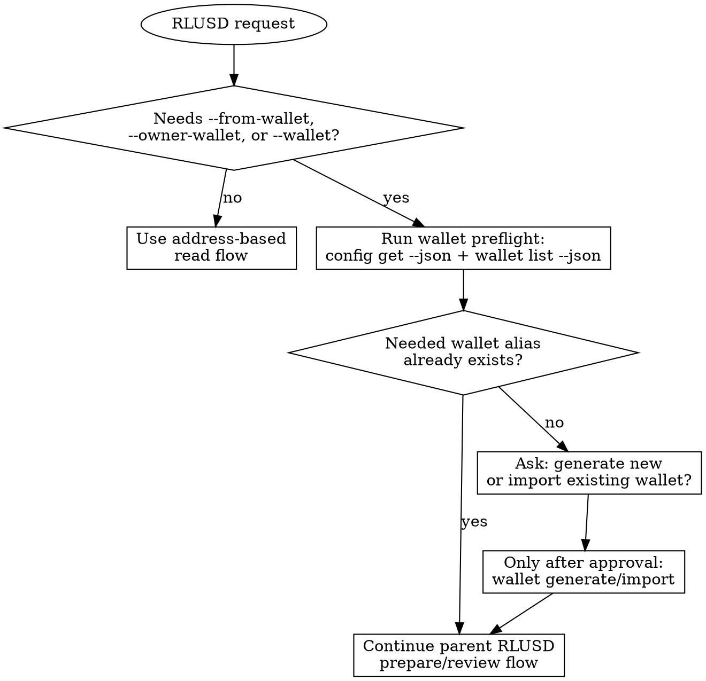

# Purpose

Use this skill when an RLUSD workflow depends on a local `rlusd-cli` wallet
alias rather than only an on-chain address.

Core principle: do wallet preflight before any wallet-backed RLUSD action.
Check safely first, then ask before creating, importing, or switching wallets.

# When To Use This Skill

- The user says "my wallet", "from my wallet", "use my Ethereum wallet", or
  similar phrasing that does not name a local `rlusd-cli` wallet alias.
- A planned command needs `--from-wallet`, `--owner-wallet`, or `--wallet`.
- An RLUSD action skill needs to know whether a local wallet already exists.
- The user wants to create, import, inspect, or select a wallet for RLUSD use.
- A wallet-backed command failed because the named wallet is missing, wrong for
  the chain, or cannot be decrypted.

# Do Not Use This Skill When

- The user only gave an explicit `0x...` or `r...` address for a read-only
  check such as balance, allowance, trust-line status, or account info.
- The task is only about resolving RLUSD metadata, venues, quotes, or other
  non-wallet reads.
- The parent flow already has a confirmed local wallet alias and does not need
  wallet inspection or setup.

# Decision Guide



- Always start with safe inspection commands.
- Prefer `--json` on wallet inspection and setup commands so the agent gets
  structured envelopes throughout the preflight.
- Never invent a wallet alias from example names like `ops` or
  `treasury-xrpl`.
- Only create, import, or switch a wallet after explicit user approval.
- After wallet preflight succeeds, return to the parent RLUSD skill and
  continue at the parent flow's `prepare` step.

# Current Command Sequence

```bash
rlusd config get --json
rlusd wallet list --json
rlusd wallet address --chain ethereum --json
rlusd wallet address --chain xrpl --json

rlusd wallet generate --chain ethereum --name ops --password "$RLUSD_WALLET_PASSWORD" --json
rlusd wallet generate --chain xrpl --name treasury-xrpl --password "$RLUSD_WALLET_PASSWORD" --json

rlusd wallet import --chain ethereum --name ops --private-key 0x... --password "$RLUSD_WALLET_PASSWORD" --json
rlusd wallet import --chain ethereum --name ops --mnemonic "word1 word2 ..." --password "$RLUSD_WALLET_PASSWORD" --json
rlusd wallet import --chain xrpl --name treasury-xrpl --secret s... --password "$RLUSD_WALLET_PASSWORD" --json

rlusd wallet use ops --chain ethereum --json
rlusd wallet use treasury-xrpl --chain xrpl --json

rlusd wallet export-seed --wallet <name> --password "$RLUSD_WALLET_PASSWORD" --json

rlusd wallet keychain enable <name> --password "$RLUSD_WALLET_PASSWORD"
rlusd wallet keychain disable <name>
rlusd wallet keychain status [name] [--chain <chain>]
```

# Wallet Preflight

1. Run `rlusd config get --json` to confirm the active network and default chain.
2. Run `rlusd wallet list --json` to see whether the needed local wallet alias
   already exists.
3. If the parent flow needs the current default wallet address, use
   `rlusd wallet address --chain <chain> --json`.
4. If the alias exists, return to the parent RLUSD skill and continue with the
   wallet-backed `prepare` step.
5. If the alias is missing, ask whether the user wants to:
   - generate a new wallet, or
   - import an existing wallet.
6. Only after approval, run the matching `wallet generate` or `wallet import`
   command with `--json`.
7. If the user wants that alias to become the default wallet for the chain, run
   `rlusd wallet use <name> --chain <chain> --json`.
8. Keychain storage is enabled by default for new wallets and imports on macOS.
   To manually manage Keychain entries, use `rlusd wallet keychain enable|disable|status`.
   Pass `--no-store-in-keychain` to `wallet generate` or `wallet import` to opt
   out of automatic Keychain storage at creation time.
9. To export an XRPL wallet seed (e.g., for third-party import), use
   `rlusd wallet export-seed --wallet <name> --password "$RLUSD_WALLET_PASSWORD" --json`.

# Quick Reference

- Inspect config: `rlusd config get --json`
- List local wallets: `rlusd wallet list --json`
- Show current default wallet address: `rlusd wallet address --chain <chain> --json`
- Generate a new wallet: `rlusd wallet generate --chain <chain> --name <name> --json`
- Import an existing wallet: `rlusd wallet import --chain <chain> --name <name> ... --json`
- Set the default wallet: `rlusd wallet use <name> --chain <chain> --json`
- Export XRPL seed: `rlusd wallet export-seed --wallet <name> --password "$RLUSD_WALLET_PASSWORD" --json`
- Enable Keychain for a wallet: `rlusd wallet keychain enable <name> --password "$RLUSD_WALLET_PASSWORD"`
- Disable Keychain for a wallet: `rlusd wallet keychain disable <name>`
- Check Keychain status: `rlusd wallet keychain status [name] [--chain <chain>]`
- Password source: prefer `RLUSD_WALLET_PASSWORD` for encrypted wallet actions.
  Keychain storage is enabled by default for new wallets and imports on macOS.

# Example

For "Send 25 RLUSD on Ethereum from my wallet":

1. Run `rlusd config get --json`
2. Run `rlusd wallet list --json`
3. If no Ethereum wallet alias exists, ask whether to generate or import one
4. Only after wallet setup is confirmed, return to `rlusd-transfer` and run
   `rlusd evm transfer prepare --chain ethereum-mainnet --from-wallet <wallet_name> ...`

# Common Mistakes

- Treating example aliases like `ops` or `treasury-xrpl` as proof those wallets
  already exist locally.
- Confusing an XRPL `r...` account address with the local signer alias required
  by `--wallet`.
- Auto-generating or auto-importing a wallet without explicit user approval.
- Skipping `rlusd config get` and then preparing a wallet for the wrong network
  or chain.
- Forgetting `RLUSD_WALLET_PASSWORD` when the CLI needs to decrypt an encrypted
  wallet.
- Not understanding the password resolution order: `--password` flag first, then
  `RLUSD_WALLET_PASSWORD` env var, then Keychain. Keychain is only consulted as
  a last resort. If `--password` or the env var is set, Keychain is never read.
  Use `rlusd wallet keychain status [name]` to check Keychain state when neither
  the flag nor the env var is present and decryption fails.

# Common Rationalizations

| Excuse | Reality |
|--------|---------|
| "The docs use `ops`, so I can use that alias." | Example aliases are not proof the wallet exists on this machine. |
| "The user said 'my wallet', so I know what they mean." | You still need a concrete local wallet alias or a wallet setup step. |
| "I can generate a wallet now and ask later." | Wallet generate/import changes local state and needs explicit approval. |
| "The XRPL address is the wallet." | XRPL flows can need both the on-ledger `r...` address and the local signer alias. |

# Red Flags

- Jumping straight to `--from-wallet`, `--owner-wallet`, or `--wallet` without
  `rlusd wallet list --json`
- Guessing a wallet alias from examples
- Treating `r...` as the signer alias for XRPL execute commands
- Creating or importing a wallet just to unblock a flow without asking
- Continuing to `prepare` before wallet preflight is settled
